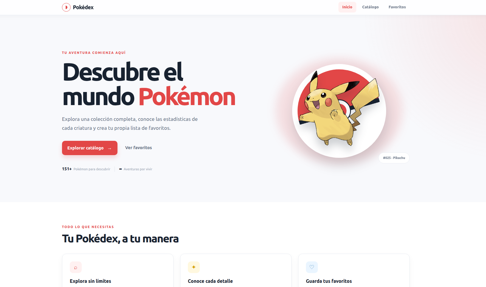
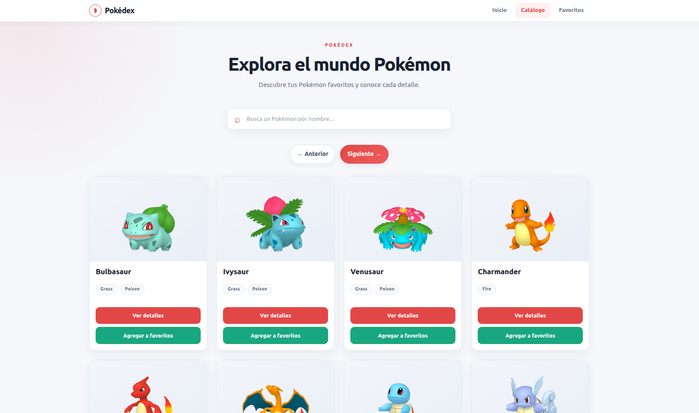
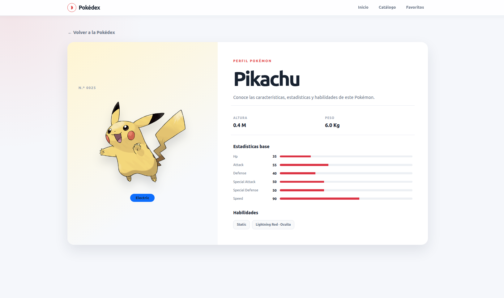
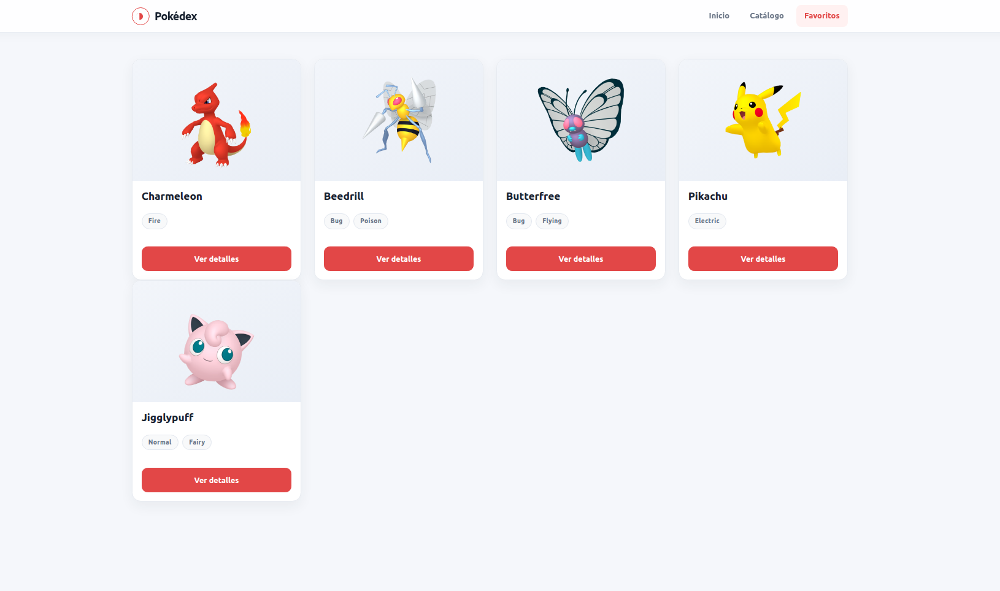

## Pokédex App
Esta es una Pokédex virtual interactiva pensada para explorar el universo Pokémon de forma sencilla. El proyecto combina los datos oficiales de la franquicia con una interfaz moderna cuyo diseño visual fue generado con herramientas de Inteligencia Artificial.
La aplicación se conecta en tiempo real con la base de datos oficial (PokeAPI) para ofrecer una navegación fluida al buscar criaturas, revisar estadísticas de combate y gestionar una lista propia de favoritos.
## Funciones de la aplicación

* Inicio temático: Una pantalla de bienvenida diseñada para introducir al usuario en la experiencia desde el primer momento.
* Buscador integrado: Permite encontrar cualquier Pokémon al instante filtrando por las primeras letras de su nombre.
* Fichas técnicas detalladas: Al seleccionar una criatura se despliega su perfil completo con su número de registro, peso y altura convertidos al sistema métrico, habilidades especiales y estadísticas base (vida, ataque o defensa) representadas mediante barras visuales.

* Sección de favoritos: Un sistema que permite guardar o quitar Pokémon de una lista personalizada mediante un botón, haciéndolos accesibles desde su propia pestaña.

## Tecnologías utilizadas
Para el desarrollo del proyecto se seleccionaron herramientas actuales.

* React: Permite que la interfaz responda de forma inmediata a las interacciones del usuario sin necesidad de recargar la página.
* React Bootstrap: Facilita una estructura limpia, organizada en tarjetas responsivas y componentes estilizados.
* React Router: Gestiona la navegación interna entre las secciones de inicio, catálogo, favoritos y la vista de detalles.
* Axios: Se encarga de realizar las peticiones a la API externa para obtener las imágenes y la información de manera eficiente.

## Vista previa de la aplicación

| Inicio
| :---: 
  
  
| Catálogo
| :---: 
  
  

| Detalles
| :---: 
  
  

| Favoritos
| :---: 
  
  

